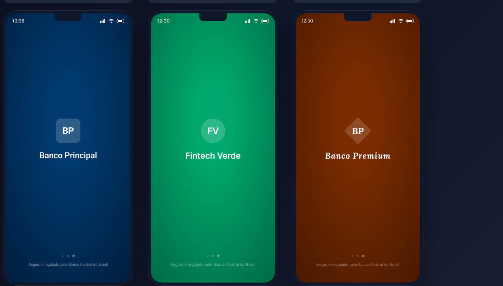
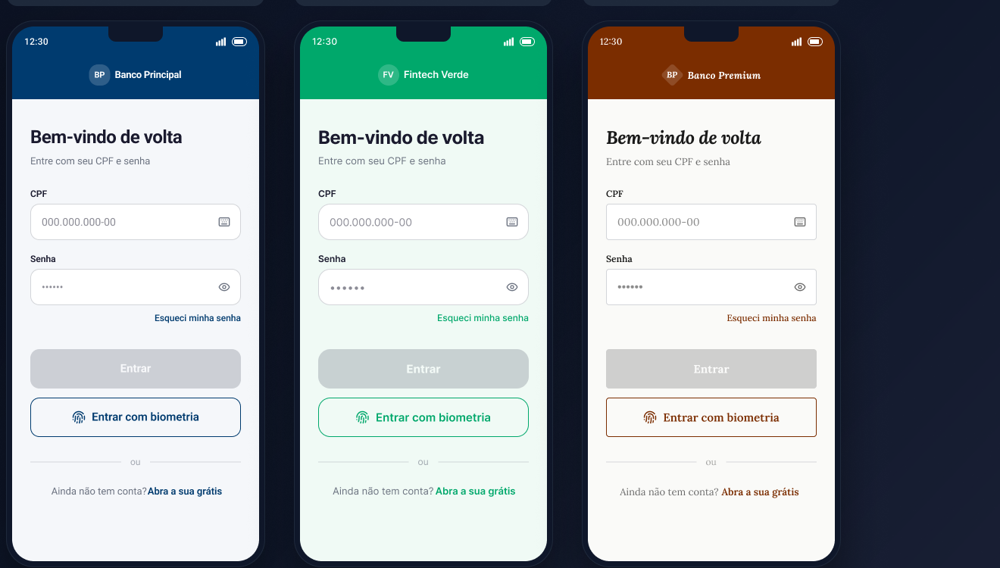
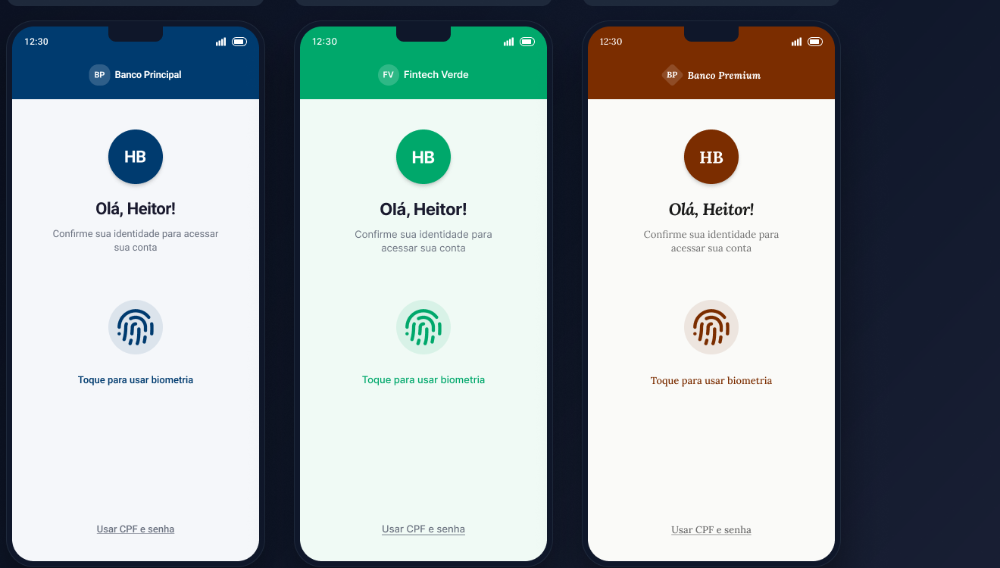
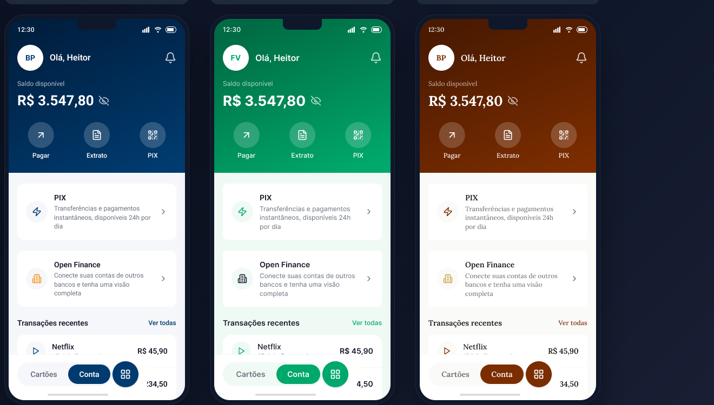
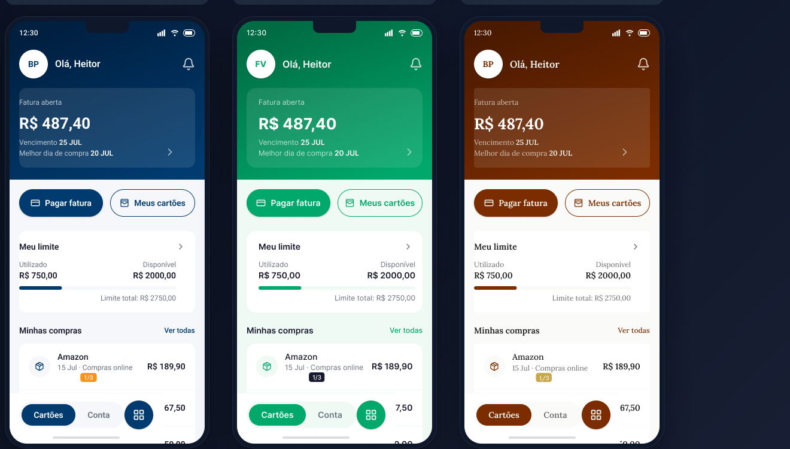
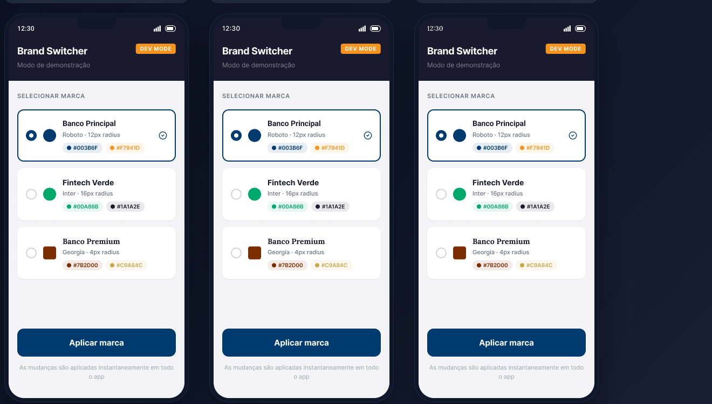

# mobile-one

> *One codebase. Native experience.*

POC técnica para demonstrar que **Kotlin Multiplatform (KMP) com UI nativa** é uma alternativa superior ao React Native para um aplicativo bancário cross-platform e white-label.

---

## Telas do app (white-label)

As mesmas telas, nas **3 marcas** da POC — Banco Principal (`#003B6F`), Fintech Verde (`#00A86B`) e Banco Premium (`#782D00`). Designs de referência no [Figma Mobile-One](https://www.figma.com/design/i0v5vLAdG0PMWZ6bYwUb0h/Mobile-One).

| Marca | Primary | Tipografia | Radius |
|---|---|---|---|
| Banco Principal | `#003B6F` | Roboto | 12dp |
| Fintech Verde | `#00A86B` | Inter | 16dp |
| Banco Premium | `#782D00` | Georgia | 4dp |

### Splash



### Login



### Biometria



### Home / Conta



### Home / Cartões



### Brand Switcher



---

## Estrutura do projeto

```
mobile-one/
├── .cursor/rules/          # Contexto do projeto para agentes de IA (Memory Bank)
├── docs/
│   ├── assets/screenshots/ # Previews das telas (3 marcas) para o README
│   ├── adr/                # Architecture Decision Records — decisões e argumentos
│   ├── specs/              # Especificações de features e contratos de interface
│   └── poc-pitch/          # Material de apresentação para gestores
├── shared/                 # KMP — Kotlin Multiplatform (dados + domínio)
├── androidApp/             # Android — Jetpack Compose
└── iosApp/                 # iOS — SwiftUI
```

## Documentação

### Architecture Decision Records

| ADR | Título | Status |
|---|---|---|
| [ADR-001](docs/adr/ADR-001-kmp-vs-react-native.md) | KMP com UI Nativa vs React Native | Aceito |
| [ADR-002](docs/adr/ADR-002-sqldelight-persistencia.md) | SQLDelight como persistência compartilhada | Aceito |
| [ADR-003](docs/adr/ADR-003-ktor-http-client.md) | Ktor como HTTP client compartilhado | Aceito |
| [ADR-004](docs/adr/ADR-004-white-label-strategy.md) | Estratégia white-label via shared config | Aceito |
| [ADR-005](docs/adr/ADR-005-biometria-expect-actual.md) | Biometria e segurança via expect/actual | Aceito |

### Specs de Features (POC)

| Spec | Feature | Status |
|---|---|---|
| [SPEC-001](docs/specs/SPEC-001-login-biometrico.md) | Login com Autenticação Biométrica | Aprovado |
| [SPEC-002](docs/specs/SPEC-002-saldo-extrato.md) | Saldo e Extrato de Conta | Aprovado |
| [SPEC-003](docs/specs/SPEC-003-pix.md) | Transferência PIX | Aprovado |
| [SPEC-004](docs/specs/SPEC-004-white-label-config.md) | Demonstração White-Label | Aprovado |

### Material de Apresentação

- [Comparativo KMP vs React Native](docs/poc-pitch/comparativo-kmp-vs-react-native.md)
- [Roadmap de Migração](docs/poc-pitch/roadmap-migracao.md)
- [Métricas da POC](docs/poc-pitch/metricas-poc.md)

## Stack

| Camada | Tecnologia |
|---|---|
| Shared (dados + domínio) | Kotlin Multiplatform (KMP) |
| Android UI | Jetpack Compose |
| iOS UI | SwiftUI |
| HTTP client | Ktor |
| Persistência local | SQLDelight |
| Injeção de dependência | Koin |
| Async | Kotlin Coroutines + Flow |

## Como rodar o projeto

Pré-requisitos: JDK 17, Android SDK (`ANDROID_HOME`), Xcode e [XcodeGen](https://github.com/yonaskolb/XcodeGen) (`brew install xcodegen`).

```bash
# Shared — compilar e testar (Android + iOS Simulator)
./gradlew :shared:build
./gradlew :shared:allTests

# Android — gerar o APK debug
./gradlew :androidApp:assembleDebug

# iOS — gerar o projeto Xcode e buildar para o simulador
cd iosApp
xcodegen generate
xcodebuild -project iosApp.xcodeproj -scheme iosApp \
  -destination 'platform=iOS Simulator,name=iPhone 17 Pro' build
```

O `iosApp.xcodeproj` é gerado a partir de `iosApp/project.yml` (não é versionado à mão) e
possui uma fase de build que roda `./gradlew :shared:embedAndSignAppleFrameworkForXcode`
automaticamente antes de compilar o app, para embutir o framework `shared` mais recente.

## Workflow de desenvolvimento

1. Escrever/revisar a **spec** em `docs/specs/` antes de qualquer código
2. Definir contratos no `shared/commonMain` (interfaces, expect)
3. Implementar no shared (use cases, repositórios, actual)
4. Escrever testes do shared (rodam em Android e iOS)
5. Criar telas no **Figma Make** → importar para Figma Design
6. Implementar UI via **MCP do Figma** em Compose (Android) e SwiftUI (iOS)

## Contexto

Este projeto é uma POC criada pelo time de desenvolvimento Android/iOS de um banco para demonstrar aos gestores que existe uma alternativa ao React Native que:

- Compartilha **70–80% do código** (camadas de dados e domínio)
- Mantém **performance 100% nativa** sem bridges JavaScript
- Preserva o **know-how técnico** do time atual
- Suporta **white-label** via configuração no shared
- É viável para um **app bancário regulado** pelo Banco Central
